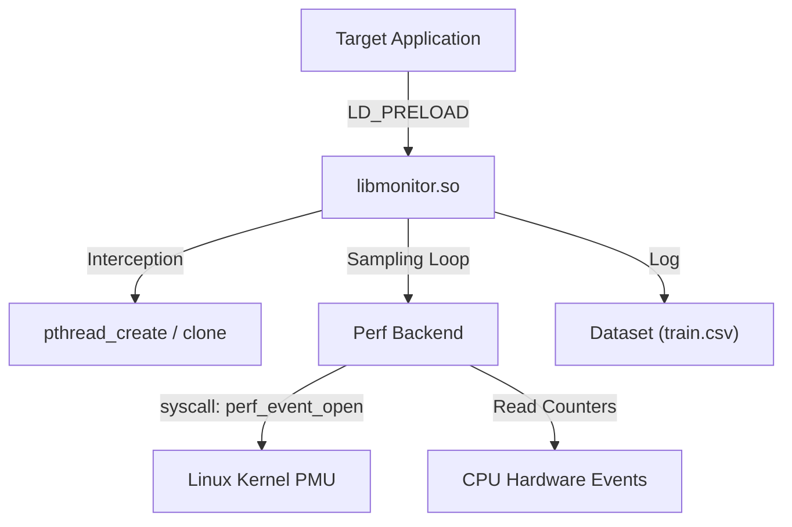

# OpenPerfML
**Cross Platform Performance Feature Extraction Toolkit for Machine & Deep Learning**

OpenPerfML is an **open-source C-based toolkit** designed to monitor and extract low level system performance metrics across diverse platforms.  


> **Status:** Active Development. Verified on Linux / Intel 12th Gen (Alder Lake).
> Feel free to **modify, adapt, and extend** the codebase to your needs.

---

## Current Applicability (Important)
While the long-term vision is cross-platform, the **current verified target is:**

- **Linux**
- **Intel Alder Lake hybrid CPUs (P-cores + E-cores)**

This is because the current implementation:
- distinguishes **P vs E cores** using `/sys/devices/system/cpu/cpu*/topology/core_type`
- uses **core-type-aware event selection** for some counters (hybrid-specific)
- relies on a Linux `perf_event_open` backend (hardware/event mappings are CPU-specific)

If you run on non-hybrid Intel CPUs or non-Intel platforms, additional validation and event mapping work is required.

---

## Verification (Counters & Ratios)
Performance counter values and derived ratios used by OpenPerfML have been **verified on Intel Alder Lake** against **Intel VTune** to ensure the collected signals match expected behavior.

OpenPerfML uses hardware events such as `CPU_CLK_UNHALTED.THREAD` (see `source/perf_backend.h/.c`) alongside additional counters to derive features like IPC/CPI and cache/memory stall ratios.

---
## Project Structure 
```text
OpenPerfML/
├── source/
│   ├── libmonitor.c       # Main injection logic & thread tracking
│   ├── monitor.h          # Feature extraction definitions
│   └── perf_backend.c     # Linux perf_event_open syscall wrappers
├── scripts/
│   └── monitor_script.sh  # Build & orchestration automation
└── examples/
    └── highmiss_loop.c    # Synthetic workload for validation
```
---
## What It Does
OpenPerfML provides the building blocks for analyzing and classifying system-level performance data.  
It enables feature collection and can be extended to feed machine learning pipelines, rule-based systems, monitoring dashboards and more.

At a high level, OpenPerfML:
- attaches to a target workload using **`LD_PRELOAD`**
- dynamically tracks threads at runtime (no source changes required in the target program)
- periodically samples performance counters and OS-level signals
- aggregates deltas per sampling window and derives features suitable for ML datasets

### Example Use Cases
- Collecting compute, memory and I/O traces for **ML model optimization**
- Monitoring performance features for **MLOps observability** and system health tracking
- Providing datasets for **anomaly detection** or **intelligent resource management**
- Implementing **rule-based inference systems** or lightweight **embedded ML analyzers**

---

## How It Works (Dynamic Interception)
OpenPerfML is designed to work without modifying the target workload. It relies on dynamic interception to discover and track threads:

- intercepts `pthread_create()` to wrap new threads
- intercepts `clone()` (where applicable) to detect additional thread creation paths
- runs a lightweight monitoring loop that samples at a configurable interval
- supports per-thread aggregation and process-level feature output

---

## Modes: Observation vs Training
OpenPerfML supports two main workflows:

### 1) Observation mode
- Collects and reports runtime features (no forced placement).
- Intended for profiling/telemetry collection.

### 2) Training mode (Alder Lake only)
- Forces threads onto **P** or **E** cores (hybrid-aware).
- Optionally logs a **CSV dataset** (one row per sampling window) for ML training.
- Supports warmup windows to skip initial transient behavior.

---

## Key Features
- **Modular architecture**
  - `source/libmonitor.c` + `source/monitor.h`: monitoring + feature extraction (`LD_PRELOAD`)
  - `source/perf_backend.c/.h`: Linux perf backend (`perf_event_open`)
- **Dataset generation** (CSV logging in training mode)
- **Thread-aware telemetry** (per-thread deltas aggregated into process-level features)
- **Open-source and extensible** by design — feel free to edit and adapt

---
## Collected Features (Dataset Schema)
OpenPerfML aggregates raw hardware counters into **normalized ratios** per sampling window. These features are selected to characterize workload behavior (Compute vs. Memory vs. I/O) independent of execution time.

The tool currently exports the following features (as defined in `PerformanceRatios`):

| Feature | Description | Relevance |
| :--- | :--- | :--- |
| **IPC** | Instructions Per Cycle | General throughput metric (High = Compute Bound). |
| **Cache Miss Ratio** | LLC Misses / Total Accesses | Indicates memory pressure / poor locality. |
| **Uops/Cycle** | Micro-ops per Cycle | Pipeline utilization efficiency. |
| **Mem Stall/Mem Inst** | Memory Stalls per Memory Instruction | Latency cost of memory operations. |
| **Mem Stall/Inst** | Memory Stalls per Total Instruction | Global impact of memory latency. |
| **Fault Rate** | Page Faults per Memory Instruction | Virtual memory pressure / trashing. |
| **I/O Throughput** | Read/Write Bytes per Cycle | Disk/Network I/O intensity. |

```c
typedef struct {
    double IPC;                         // Instructions Per Cycle
    double Cache_Miss_Ratio;            // Last Level Cache Misses / References
    double Uop_per_Cycle;               // Micro-operations retired per cycle
    double MemStallCycle_per_Mem_Inst;  // Stall cycles due to loads / total loads
    double MemStallCycle_per_Inst;      // Stall cycles due to memory / total instructions
    double Fault_Rate_per_mem_instr;    // Page faults per memory access
    double RChar_per_Cycle;             // I/O Read chars per cycle (syscalls)
    double WChar_per_Cycle;             // I/O Write chars per cycle (syscalls)
    double RBytes_per_Cycle;            // Disk Read bytes per cycle
    double WBytes_per_Cycle;            // Disk Write bytes per cycle
} PerformanceRatios;
```
> **Note:** Raw counters (cycles, instructions, cache references) are also available in the raw log output if needed.
---
## Dependencies
- Linux
- GCC/Clang (C99)
- `pthread`, `dl`
- Access to Linux perf counters (may require permissions):
  - check `/proc/sys/kernel/perf_event_paranoid`
  - Linux with perf_event_paranoid <= 1

---

## Build & Run

#### Build the preload library
```bash
./scripts/monitor_script.sh build
```

## Optional build variants:
```bash
./scripts/monitor_script.sh build --split
./scripts/monitor_script.sh build --quiet
./scripts/monitor_script.sh build --split --quiet
```

## Build the example workload
```bash
gcc -O2 -o examples/highmiss_loop examples/highmiss_loop.c
chmod +x examples/highmiss_loop
```

## Observation mode 
```bash
./scripts/monitor_script.sh run \
  --mode observe \
  --workload examples/highmiss_loop \
  --args "5 5 20000"
```

## Training mode (force P/E and optionally log CSV)
```bash
./scripts/monitor_script.sh run \
  --mode train \
  --force P \
  --dataset train_P.csv \
  --run-id runP \
  --workload-name highmiss_loop \
  --warmup 5 \
  --workload examples/highmiss_loop \
  --args "5 5 20000"
```

## Modify / Extend (Alder Lake events)
If you want to collect different hardware events on **Intel Alder Lake**, use Intel’s official event reference and update the perf event mappings:

- Event reference (Alder Lake P-core): [Intel PerfMon Events – Alder Lake P-core](https://perfmon-events.intel.com/platforms/alderlake/core-events/p-core/#p-core-events)
- Edit the event configuration in:
  - `source/perf_backend.h`
  - `source/perf_backend.c`

After updating the event list/mappings, rebuild:
```bash
./scripts/monitor_script.sh build
```

## Customization / Research Use
This project is intended to be modified:
- Add/replace events in `source/perf_backend.c/.h` for new CPUs
- Extend the dataset schema for new features
- Add new workloads under `examples/` for validation


